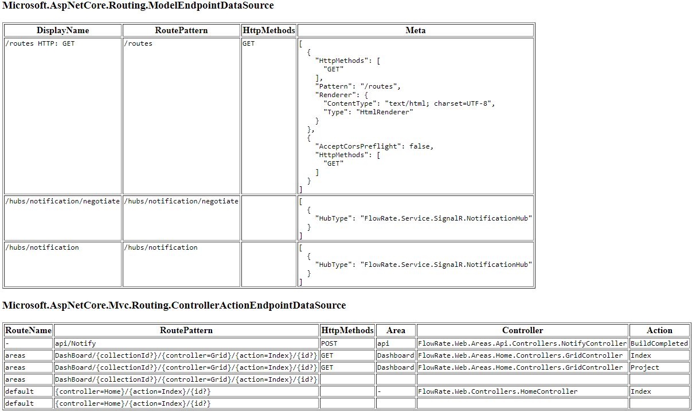

# AspNetCore.DisplayRoutes
View route information for AspNetCore projects.  
Given that routes are registered with the (new since 3.0) AspNetCore IEndpointRouteBuilder, like below, or through Attributes; 

```c#
  app.UseEndpoints(endpoints => { ...
```
## Screenshot



## Packages
|   |  Stable   |   CI |
| - | -------------- | -------------- | 
| AspNetCore.DisplayRoutes |  | [GPR](https://github.com/dogguts/AspNetCore.DisplayRoutes/packages/324648) |

## Usage
AspNetCode.DisplayRoutes can add an additional route to your application where, when visited, will report all registered routes in your application.

### Add a reference to the AspNetCore.DisplayRoutes nuget package in your (web) project:
```Powershell
#Package manager
Install-Package AspNetCore.DisplayRoutes
```
or
```sh
#CLI
dotnet add package AspNetCore.DisplayRoutes
```
or 
```xml
<ItemGroup>
 ...
 <PackageReference Include="AspNetCore.DisplayRoutes" Version="1.*" />
 ...
</ItemGroup>
```
or 
use the "NuGet Package Manager" in Visual Studio

